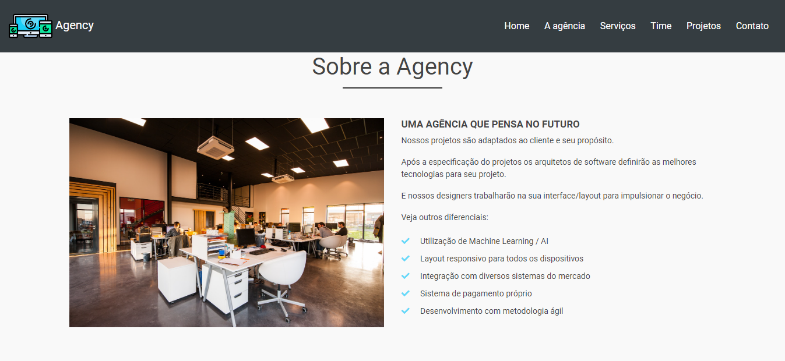

# Curso Bootstrap Hora de Codar
Curso desenvolvido por [Matheus Battisti - Hora de Codar](https://www.youtube.com/channel/UCDoFiMhpOnLFq1uG4RL4xag)

- [Curso de Bootstrap](https://www.youtube.com/playlist?list=PLnDvRpP8Bnexu5wvxogy6N49_S5Xk8Cze)

## Dependências
- [Bootstrap](https://getbootstrap.com)
- [Font Awesome](https://fontawesome.com/v4.7.0/icons/)
- [Google Fonts](https://fonts.google.com/)
- [Progress Bar](https://github.com/kimmobrunfeldt/progressbar.js/)
- [Parallax](https://pixelcog.github.io/parallax.js/)
- [JQuery](https://jquery.com/)

## Carousel

## About

## Card

## Grid parallax

